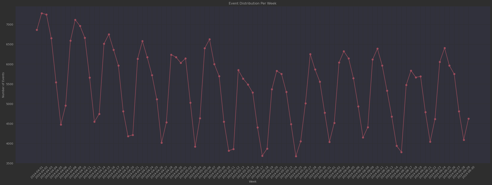

# Test Task | Pavlo Kukurik

### Для клонування репозиторію:

```bash
    git clone https://github.com/PavloKukurik/Test_task_PA_Headway
    cd Test_task_PA_Headway
```
---

## Завдання №1 | Робота з базою даних:

### Умова завдання:

Є таблиця в BiqQuery по платіжках юзерів, у якій є такі значення: 

```jsx
event_date(date) - дата коли відбулася подія
subscription_name(string) - назва підписки
(якщо там є слово monthly то це місячна підписка, якщо є слово annually - річна)
country(string) - країна юзера
subscriber_id(string) - унікальний айді юзера
customer_price(float) - ціна юзера, що він заплатив за підписку
customer_currency(string) - валюта юзера
refund(boolean) - чи була ця транзакція рефаундом (Yes/No)
```

У додатку модель монетизації - підписка. Є підписки з тріальним періодом(тобто на 0 день юзер бере тріал і у базі є запис де у юзера відбулась транзакція, у якої ціна = 0, а також є підписки безтріальні, де початковий запис буде транзакція з ціною >0). Також в базу записуються дані про refund підписки, це відповідно звичайна транзакція в якій в полі refund буде дорівнювати Yes.
Напиши, будь ласка, такі запити:

1. Порахувати когортно скільки ми заробили кожного дня. Якщо юзер 01/01 взяв тріал і ми отримали з нього гроші на 8мий день, то він записується в 01/01. Рахувати Gross Revenue.
2. Порахувати на який день в середньому юзер робить refund. 
3. Порахувати по місячним тарифам конверти в 2, 3, 4, 5 і 6ту оплату. Брати когорту місячну. Тобто, мені важливо знати як люди, що вперше купили підписку, наприклад, в жовтні потім далі купували наступні підписки.

---

### 1️⃣ Когортний підрахунок Gross Revenue

Ми хочемо визначити дохід, який приносять користувачі з моменту їхньої першої підписки. 

### SQL-запит:

```sql
WITH first_transaction AS (
  SELECT
    subscriber_id,
    MIN(event_date) AS cohort_date
  FROM `instant-guard-454911-q4.test_dataset.subscriptions`
  WHERE customer_price > 0 OR refund = 'No'
  GROUP BY subscriber_id
)

SELECT
  ft.cohort_date,
  s.event_date,
  SUM(s.customer_price) AS gross_revenue
FROM `instant-guard-454911-q4.test_dataset.subscriptions` s
JOIN first_transaction ft ON s.subscriber_id = ft.subscriber_id
WHERE s.customer_price > 0
GROUP BY 1, 2
ORDER BY 1, 2;
```

---

### 2️⃣ Середній день refund

Ми хочемо визначити середню кількість днів від моменту першої оплати до першого refund  для кожного користувача.

### SQL-запит:

```sql
WITH refund_days AS (
  SELECT
    subscriber_id,
    MIN(event_date) AS first_payment_date,
    MIN(CASE WHEN refund = 'Yes' THEN event_date END) AS refund_date
  FROM `instant-guard-454911-q4.test_dataset.subscriptions`
  WHERE customer_price > 0
  GROUP BY subscriber_id
)

SELECT
  AVG(DATE_DIFF(refund_date, first_payment_date, DAY)) AS avg_days_to_refund
FROM refund_days
WHERE refund_date IS NOT NULL;
```

---

### 3️⃣ Конверсія у 2, 3, 4, 5 і 6 оплату для місячних підписок

Визначення, скільки користувачів з кожної когорти продовжили оплачувати підписку через 1, 2, 3, 4, 5 та 6 місяців.

### SQL-запит:

```sql
WITH first_payments AS (
  SELECT
    subscriber_id,
    MIN(event_date) AS first_payment_date
  FROM `instant-guard-454911-q4.test_dataset.subscriptions`
  WHERE subscription_name LIKE 'monthly%' AND customer_price > 0
  GROUP BY subscriber_id
),
subsequent_payments AS (
  SELECT
    s.subscriber_id,
    fp.first_payment_date,
    s.event_date,
    DATE_DIFF(s.event_date, fp.first_payment_date, DAY) / 30 + 1 AS payment_number
  FROM `instant-guard-454911-q4.test_dataset.subscriptions` s
  JOIN first_payments fp ON s.subscriber_id = fp.subscriber_id
  WHERE s.subscription_name LIKE 'monthly%' AND s.customer_price > 0
)

SELECT
  EXTRACT(YEAR FROM first_payment_date) AS cohort_year,
  EXTRACT(MONTH FROM first_payment_date) AS cohort_month,
  COUNT(DISTINCT CASE WHEN payment_number = 1 THEN subscriber_id END) AS first_payment_users,
  COUNT(DISTINCT CASE WHEN payment_number = 2 THEN subscriber_id END) AS second_payment_users,
  COUNT(DISTINCT CASE WHEN payment_number = 3 THEN subscriber_id END) AS third_payment_users,
  COUNT(DISTINCT CASE WHEN payment_number = 4 THEN subscriber_id END) AS fourth_payment_users,
  COUNT(DISTINCT CASE WHEN payment_number = 5 THEN subscriber_id END) AS fifth_payment_users,
  COUNT(DISTINCT CASE WHEN payment_number = 6 THEN subscriber_id END) AS sixth_payment_users
FROM subsequent_payments
GROUP BY 1, 2
ORDER BY 1, 2;
```

---

### Приклад Виводу Запитів:

Для тестування запитів, я створив наступну таблицю

```sql
CREATE OR REPLACE TABLE `mythic-inn-387315.test_dataset.subscriptions` AS
WITH temp AS (
  SELECT * FROM UNNEST([
    STRUCT(DATE '2024-01-01' AS event_date, 'monthly_basic' AS subscription_name, 'US' AS country, 
           'user_1' AS subscriber_id, 0.00 AS customer_price, 'USD' AS customer_currency, 'No' AS refund),
    STRUCT(DATE '2024-01-08', 'monthly_basic', 'US', 'user_1', 9.99, 'USD', 'No'),
    STRUCT(DATE '2024-02-08', 'monthly_basic', 'US', 'user_1', 9.99, 'USD', 'No'),
    STRUCT(DATE '2024-03-08', 'monthly_basic', 'US', 'user_1', 9.99, 'USD', 'Yes'),

    STRUCT(DATE '2024-02-10', 'monthly_premium', 'UK', 'user_2', 0.00, 'GBP', 'No'),
    STRUCT(DATE '2024-02-17', 'monthly_premium', 'UK', 'user_2', 12.99, 'GBP', 'No'),
    STRUCT(DATE '2024-03-17', 'monthly_premium', 'UK', 'user_2', 12.99, 'GBP', 'No'),
    STRUCT(DATE '2024-04-17', 'monthly_premium', 'UK', 'user_2', 12.99, 'GBP', 'No'),

    STRUCT(DATE '2024-03-05', 'annually_premium', 'DE', 'user_3', 99.99, 'EUR', 'No'),
    STRUCT(DATE '2025-03-05', 'annually_premium', 'DE', 'user_3', 99.99, 'EUR', 'No'),

    STRUCT(DATE '2024-04-01', 'monthly_basic', 'CA', 'user_4', 9.99, 'CAD', 'No'),
    STRUCT(DATE '2024-05-01', 'monthly_basic', 'CA', 'user_4', 9.99, 'CAD', 'Yes'),

    STRUCT(DATE '2024-01-15', 'monthly_basic', 'US', 'user_5', 0.00, 'USD', 'No'),
    STRUCT(DATE '2024-01-22', 'monthly_basic', 'US', 'user_5', 9.99, 'USD', 'No'),
    STRUCT(DATE '2024-02-22', 'monthly_basic', 'US', 'user_5', 9.99, 'USD', 'No'),

    STRUCT(DATE '2024-06-01', 'monthly_basic', 'US', 'user_6', 0.00, 'USD', 'No'),
    STRUCT(DATE '2024-06-08', 'monthly_basic', 'US', 'user_6', 9.99, 'USD', 'Yes')
  ])
)
SELECT * FROM temp;

```

---

### Результати:

Запит №1:


---

Запит №2:


---

Запит №3


---

## Завдання №2 Робота з спліт-тестами

---

### Умова завдання:

Команда продукту проводить ось такий тест: 


Команда змінює вигляд опису саммері, аби покращити загальну дочитку. 

Нові описи були введені на 100 саммері у тестовій группі.

**Питання:** 

1. Сформулюй гіпотезу для цього тесту 
2. Які показники будеш перевіряти в кожній групі для цього теста? 
3. Тест показав, що конверсія завершення саммері впала на 6% у тестовій групі A, тоді як в контрольній групі вона не змінилася. Вам потрібно проаналізувати, чому це могло статися і які додаткові дані вам потрібно перевірити для підтвердження ваших міркувань. 

---

### Виконання:

### **Гіпотеза:**

Внесення змін у вигляд опису саммері (списки, категорії, додаткові елементи) сприятиме покращенню конверсії завершення саммері, покращуючи візуальне сприйняття, зручність навігації та зацікавленість користувача.

---

### **Опис тестових груп:**

Контрольна група

- Звичайний вигляд саммері без додаткових елементів.
- Основний акцент на кнопках "Listen" та "Read".

Група А

- Додано секцію "What's inside?" з переліком розділів та можливістю навігації.
- Мета: Надати чітку структуру, щоб зацікавити користувача та допомогти йому швидко орієнтуватися у змісті.

Група Б

- Додано блок "Explore categories" з додатковими категоріями для переходу, аби користувачі активніше переглядали більше схожих саммері
- Додано базові характеристики, які надають швидке розуміння структури та часу прочитання
- Мета: Сприяти залученню користувача через альтернативні шляхи взаємодії.

### Аналіз причин зниження конверсії у Групі А:

1. **Перевантаження інформацією:** Надмірно великий обсяг тексту може відштовхувати користувачів
2. **Невдала структура:** Секція "What's inside?", що пенетягує на себе увагу корстувача
3. **Відволікання:** Користувачі більше концентрувалися на навігації, ніж на читанні.

---

### Необхідні додаткові дані для перевірки:

- **Статистика натискань:** Аналіз кліків та прокручування
- **Час:** Інтервали між читанням та загальний витрачений час
- **Місце завершення:** Визначення точок, де користувачі припиняють читання.
- **Відгуки користувачів:** Опитування для отримання прямих коментарів.
- **Категоризація користувачів:** Перевірка впливу змін на різні групи користувачів

---

### Висновки

Негативний вплив на конверсію у Групі А може бути пов'язаний з перевантаженням користувача інформацією та неефективною структурою. Необхідно провести додаткові тести із детальнішою інформацією

---

## Завдання №3: Обробка масиву даних та презентація результатів

### Умова завдання:

У прикріпленому файлі містяться дані по прочитанню саммарі користувачами застосунку Headway:

[reading_data.csv](attachment:ec8db2d8-3634-4bc8-8c8f-4b14b6c414b0:reading_data.csv)

```
event_time - дата коли відбулася подія
user_id - унікальний айді юзера
country - країна юзера
event_type - івент, який виконав юзер: початок або закінчення саммері (summary_start/summary_last_page)
event_properties_book_id - унікальний айді саммері, яку читав юзер
event_properties_format - формат в якому читалось саммері audio/text
user_properties_age - вік користувача
```

Також наданий датасет з інформацією до якої категорії належить кожне саммарі

[summary_info.csv](attachment:79f028f5-086c-4685-bdfa-e9f2e9289a32:summary_info.csv)

1. Аналіз датасету:
    1. Проаналізуй основні поведінкові патерни, тренди в датасеті.
    2. Побудуй просту модель або логіку, яка видає рекомендацію: які саммарі показувати користувачу далі, базуючись на тому, що він уже читав.
2. Презентація результатів: 
    - Підготуй звіт результатів у вигляді короткої PDF-презентації (5–7 слайдів)
    - Поясни, як твої інсайти та рекомендації можуть допомогти команді Headway поліпшити досвід користувачів.
    - Прикріпи код з коментарями, усіма обрахунками, графіками

### Основні інсайти

1. **Формат контенту:** Більшість користувачів надають перевагу аудіоформату, що слід враховувати при розробці рекомендаційної системи.
2. **Відтік користувачів:** Значний відсоток користувачів залишає платформу після короткого періоду активності
3. **Проблеми із завершенням читання:** Загальний показник Completion Rate становить лише 5.70%, що свідчить про низьку залученість користувачів.
4. **Головні ринки:** Найбільша активність спостерігається у США та англомовних та іспаномовних країнах, що відкриває можливості для оптимізації контенту під ці аудиторії.
5. **Аномальні дані:** Розподіл віку користувачів рівномірний, що викликає підозри щодо коректності запису даних або їх синтетичності.

P.S. *Значно ширший та детальніший аналіз є у `test.ipynb` або [git](https://github.com/PavloKukurik/Test_task_PA_Headway)*

## Мета завдання:

1. Проаналізувати основні поведінкові патерни, тренди та аномалії у датасеті.
2. Побудувати просту модель або логіку, яка видає рекомендацію щодо саммері для користувачів.

---

## 1. Чистка даних

Перед початком аналізу були проведені наступні етапи очищення даних:

- Видалення користувачів з невалідними значеннями у полі `user_id` (наприклад, "INVALID").
- Конвертація значень віку (`user_properties_age`) у числовий формат та видалення записів з пропущеними значеннями.
- Виявлення та видалення користувачів, які читали кілька книг одночасно. Це могло бути спричинено технічними збоями або використанням одного акаунту декількома людьми (потенційне викрадення даних користувача).
- Видалення дублікатів подій для одного користувача за один і той самий момент часу.
- Об'єднання даних з двох датасетів: основного (`reading_data.csv`) та інформаційного (`summary_info.csv`).

---

## 2. Загальний аналіз поведінкових патернів

### Основні спостереження та пояснення

---

### **2.1 Розподіл віку користувачів виглядає рівномірним**. Незалежно від того, чи користувач змінює вік протягом часу, загальний розподіл залишається рівномірним.


 Це незвично, оскільки в реальних даних зазвичай існують піки у певних вікових групах, наприклад, серед молоді або середнього віку. Така рівномірність може бути спричинена:

- Помилками у зборі даних або їх записі.
- Синтетичним походженням частини даних.
- Використанням одного акаунту різними людьми з різними віковими групами.

*Надалі дані були поділені на три вище вказані групи. Під час глибшого аналізу кожної з них я побачив, що розподіли та інші показники майже ідентичні, що підкріплює гіпотезу про  синтезовані дані. Через те, що ці групи не мають ніяких відмінностей (окрім загальної активності, що відображається лише на абсолютних значеннях з ідентичними розподілами) , то у цьому звіті буде показана загальна група* 

---

### **2.2. Користувачі, які змінюють вік, генерують більшу активність**. Незважаючи на те, що ця група користувачів менша, вони демонструють значно вищу активність.


 Це може бути пояснено наступним:

- Користувачі, які змінюють вік, могли неправильно вводити свої дані або спеціально вказувати різні значення.
- Вищий рівень активності може свідчити про те, що ця група користувачів частіше взаємодіє з платформою

---

### **2.3 Більшість користувачів обирає аудіоформат**. Загальний аналіз показав, що аудіоформат є більш популярним серед користувачів. (у всіх групах)


---

### **2.4 Основний ринок — США, а також англомовні та іспаномовні країни. Аналіз географічного розподілу показує, що найбільша активність спостерігається у США, а також у країнах з англомовними та іспаномовними користувачами. Це відкриває можливості для:**

- Покращення локалізації контенту на відповідні мови.
- Орієнтування на популярні теми для цих країн.
- Оптимізації маркетингових кампаній для цих ринків.


*Бачимо, що США домінують як за активністю так і за розподілом користувачів*

---

### **2.5 Завершення читання (Completion Rate)**. Загальний показник завершення читання дуже низький — **5.70%**.

Цей показник є критично низьким і може бути спричинений кількома факторами:

- **Великі інтервали між прочитаннями** — користувачі можуть закінчувати прочитання через великий проміжок часу. На графіку нижче видно, що багато користувачів витрачають сотні і тисячі годин на прочитання.


- **Низька залученість або нецікавість контенту** — можливе неправильне таргетування або недостатня персоналізація.
- **Проблеми з функціональністю додатку** — користувачі можуть завершувати читання без фіксації старту через технічні збої.

Також дуже велика частка тих, хто закінчив книгу не почавши її (на графіку нижче). Це може свідчити про те, що користувачі почали читати, до початку цього періоду (випливає з великих інтервалів читання)


---

### 2.6 Падіння активності в середині періоду та швидкий відтік клієнтів

На графіку нижче, можна помітити, що активність користувачів сильно впала `05-19`

*MAU:*


Був проведений аналіз по когортах і стало очевидно, що це було спричинено двома факторами:

- Зниженням потоку нових користувачів
- Швидкому відтоку клієнтів з платфоми:

Падіння може бути зумовлено нормалізацією притоку нових клієнтів після успішної маркетингової кампанії

*Детальніше про це нижче (Пункт №5)*

---

## 3. Аналіз активності користувачів

### **3.1 Погодинна активність:**

Найбільше користувачі активні в обід, що видно з наступного графіку (Найімовірніше за часовим поясом США)


---

Час події в датасеті записується за локальним часовим поясом країни, це видно що різні країни мають різні погодинні піки активності, але вони зміщені один від одного згідно з різницею у часовому поясі


### 3.2 Часовий аналіз

Піки активності користувачів припадають на **вівторок-середу**, тоді як найменша активність спостерігається у **суботу-неділю**. Це може свідчити про те, що користувачі переважно використовують додаток у робочі дні.

- Графік активності за днями тижня показує значні піки у робочі дні та спади у вихідні. Також тут видно потижневу сезональність

*DAU*



- Ця різниця між “активними та пасивними” даними зумовлена зовнішніми чинниками, а не параметрами які є в наданих даних, тому потребує додаткового дослідження з розширеними даними. Це видно на графіках нижче

*Розподіл типу споживання по днях тижня*


---

Розподіл найпопулярніших тем та найактивніших годин по днях тижня:


---

## 4. Відтік користувачів (Churn analysis) та зниження потоку нових юзерів:

Під час аналізу відтоку користувачів було виявлено, що значний відсоток користувачів припиняє використання додатку після короткого періоду активності.

*Падіння потоку користувачів*


---

Відтік клієнтів та їх утримання на платформі (дзеркальні показники):


**З цього випливає наступне:**

1. **Високий рівень відтоку** — більшість користувачів не повертаються після першого використання.
2. **Низький рівень завершення читання** може бути однією з причин відтоку.
3. **Stickiness Ratio** - середній показник дуже низький (5%), дуже мало користувачів повертаються на платформу 
4. Падіння потоку нових клієнтів могло бути спричинено  успішною маркетинговою кампанією на початку періоду. А після її завершення цей показник стабілізувався, що і могло викликати падіння активності

Детальніше це видно на цій матриці


---

## 5. Рекомендаційна логіка

Враховуючи отримані інсайти, можна побудувати просту рекомендаційну систему, орієнтовану на формат контенту, тематику та активність користувача. Вік користувачів не враховується через потенційні проблеми з коректністю його запису.

### Основні принципи:

1. **Формат контенту (audio/text):** Оскільки більшість користувачів обирає аудіоформат, логіка повинна віддавати пріоритет аудіосаммарі, якщо це відповідає вподобанням користувача.
2. **Тематика саммарі:** Рекомендувати саммарі на основі попередніх тем, які користувач часто переглядає. Визначити улюблені категорії та пропонувати схожий контент.
3. **Час активності:** Зважати на те, що піки активності припадають на вівторок-середу. Варто орієнтувати показ рекомендацій на ці дні для підвищення ймовірності взаємодії.

### Рекомендаційні стратегії:

1. **Контентний підхід:** Пропонувати користувачу саммарі схожі за темами або форматом на ті, що він переглядав раніше. Це особливо актуально для користувачів, які чітко проявляють свої вподобання.
2. **Гібридний метод:** Поєднання контентного підходу з найпопулярнішими саммарі серед подібних користувачів (Item-Based Filtering).

### Метрики для оцінки якості рекомендацій

- Click-Through Rate (CTR): Відсоток рекомендованих саммарі, на які користувач натискає.
- Conversion Rate: Відсоток саммарі, які були завершені після рекомендації.
- Precision, Recall, F1-Score: Якість рекомендацій за релевантністю.

---

## 6. Висновок

Проведений аналіз показав, що найбільш популярний формат контенту — аудіо, що варто враховувати при побудові рекомендаційної системи. Основні ринки додатку — США та англомовні та іспаномовні країни, тому оптимізація контенту для цих регіонів може покращити загальну залученість.

Низькі показники Stickiness Ratio та Completion Rate свідчать про високий рівень відтоку та недостатню залученість користувачів. Особливу увагу варто звернути на групу користувачів, які змінюють вік — вони демонструють вищу активність та ймовірно потребують іншого підходу до рекомендацій.

### Як інсайти та рекомендації допоможуть покращити досвід користувачів

1. **Персоналізація контенту:** Пріоритизація аудіоформату та релевантних тем допоможе підвищити задоволеність користувачів.
2. **Зменшення відтоку:** Розуміння причин низького Stickiness Ratio та Completion Rate дозволить створити більш ефективні рекомендації та покращити залученість.
3. **Таргетування ключових ринків:** Оптимізація контенту для англомовних користувачів покращить їхній досвід та підвищить активність.
4. **Гнучкість рекомендаційної системи:** Використання контентного підходу та гібридного методу забезпечить базову ефективність, яку можна поступово вдосконалювати.