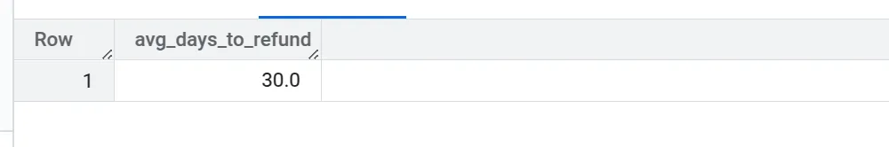

# Test Task | Pavlo Kukurik

---

## Завдання №1 | Робота з базою даних:

### Умова завдання:

Є таблиця в BiqQuery по платіжках юзерів, у якій є такі значення: 

```jsx
event_date(date) - дата коли відбулася подія
subscription_name(string) - назва підписки
(якщо там є слово monthly то це місячна підписка, якщо є слово annually - річна)
country(string) - країна юзера
subscriber_id(string) - унікальний айді юзера
customer_price(float) - ціна юзера, що він заплатив за підписку
customer_currency(string) - валюта юзера
refund(boolean) - чи була ця транзакція рефаундом (Yes/No)
```

У додатку модель монетизації - підписка. Є підписки з тріальним періодом(тобто на 0 день юзер бере тріал і у базі є запис де у юзера відбулась транзакція, у якої ціна = 0, а також є підписки безтріальні, де початковий запис буде транзакція з ціною >0). Також в базу записуються дані про refund підписки, це відповідно звичайна транзакція в якій в полі refund буде дорівнювати Yes.
Напиши, будь ласка, такі запити:

1. Порахувати когортно скільки ми заробили кожного дня. Якщо юзер 01/01 взяв тріал і ми отримали з нього гроші на 8мий день, то він записується в 01/01. Рахувати Gross Revenue.
2. Порахувати на який день в середньому юзер робить refund. 
3. Порахувати по місячним тарифам конверти в 2, 3, 4, 5 і 6ту оплату. Брати когорту місячну. Тобто, мені важливо знати як люди, що вперше купили підписку, наприклад, в жовтні потім далі купували наступні підписки.

---

### 1️⃣ Когортний підрахунок Gross Revenue

Ми хочемо визначити дохід, який приносять користувачі з моменту їхньої першої підписки. 

### SQL-запит:

```sql
WITH first_transaction AS (
  SELECT
    subscriber_id,
    MIN(event_date) AS cohort_date
  FROM `instant-guard-454911-q4.test_dataset.subscriptions`
  WHERE customer_price > 0 OR refund = 'No'
  GROUP BY subscriber_id
)

SELECT
  ft.cohort_date,
  s.event_date,
  SUM(s.customer_price) AS gross_revenue
FROM `instant-guard-454911-q4.test_dataset.subscriptions` s
JOIN first_transaction ft ON s.subscriber_id = ft.subscriber_id
WHERE s.customer_price > 0
GROUP BY 1, 2
ORDER BY 1, 2;
```

---

### 2️⃣ Середній день refund

Ми хочемо визначити середню кількість днів від моменту першої оплати до першого refund  для кожного користувача.

### SQL-запит:

```sql
WITH refund_days AS (
  SELECT
    subscriber_id,
    MIN(event_date) AS first_payment_date,
    MIN(CASE WHEN refund = 'Yes' THEN event_date END) AS refund_date
  FROM `instant-guard-454911-q4.test_dataset.subscriptions`
  WHERE customer_price > 0
  GROUP BY subscriber_id
)

SELECT
  AVG(DATE_DIFF(refund_date, first_payment_date, DAY)) AS avg_days_to_refund
FROM refund_days
WHERE refund_date IS NOT NULL;
```

---

### 3️⃣ Конверсія у 2, 3, 4, 5 і 6 оплату для місячних підписок

Визначення, скільки користувачів з кожної когорти продовжили оплачувати підписку через 1, 2, 3, 4, 5 та 6 місяців.

### SQL-запит:

```sql
WITH first_payments AS (
  SELECT
    subscriber_id,
    MIN(event_date) AS first_payment_date
  FROM `instant-guard-454911-q4.test_dataset.subscriptions`
  WHERE subscription_name LIKE 'monthly%' AND customer_price > 0
  GROUP BY subscriber_id
),
subsequent_payments AS (
  SELECT
    s.subscriber_id,
    fp.first_payment_date,
    s.event_date,
    DATE_DIFF(s.event_date, fp.first_payment_date, DAY) / 30 + 1 AS payment_number
  FROM `instant-guard-454911-q4.test_dataset.subscriptions` s
  JOIN first_payments fp ON s.subscriber_id = fp.subscriber_id
  WHERE s.subscription_name LIKE 'monthly%' AND s.customer_price > 0
)

SELECT
  EXTRACT(YEAR FROM first_payment_date) AS cohort_year,
  EXTRACT(MONTH FROM first_payment_date) AS cohort_month,
  COUNT(DISTINCT CASE WHEN payment_number = 1 THEN subscriber_id END) AS first_payment_users,
  COUNT(DISTINCT CASE WHEN payment_number = 2 THEN subscriber_id END) AS second_payment_users,
  COUNT(DISTINCT CASE WHEN payment_number = 3 THEN subscriber_id END) AS third_payment_users,
  COUNT(DISTINCT CASE WHEN payment_number = 4 THEN subscriber_id END) AS fourth_payment_users,
  COUNT(DISTINCT CASE WHEN payment_number = 5 THEN subscriber_id END) AS fifth_payment_users,
  COUNT(DISTINCT CASE WHEN payment_number = 6 THEN subscriber_id END) AS sixth_payment_users
FROM subsequent_payments
GROUP BY 1, 2
ORDER BY 1, 2;
```

---

### Приклад Виводу Запитів:

Для тестування запитів, я створив наступну таблицю

```sql
CREATE OR REPLACE TABLE `mythic-inn-387315.test_dataset.subscriptions` AS
WITH temp AS (
  SELECT * FROM UNNEST([
    STRUCT(DATE '2024-01-01' AS event_date, 'monthly_basic' AS subscription_name, 'US' AS country, 
           'user_1' AS subscriber_id, 0.00 AS customer_price, 'USD' AS customer_currency, 'No' AS refund),
    STRUCT(DATE '2024-01-08', 'monthly_basic', 'US', 'user_1', 9.99, 'USD', 'No'),
    STRUCT(DATE '2024-02-08', 'monthly_basic', 'US', 'user_1', 9.99, 'USD', 'No'),
    STRUCT(DATE '2024-03-08', 'monthly_basic', 'US', 'user_1', 9.99, 'USD', 'Yes'),

    STRUCT(DATE '2024-02-10', 'monthly_premium', 'UK', 'user_2', 0.00, 'GBP', 'No'),
    STRUCT(DATE '2024-02-17', 'monthly_premium', 'UK', 'user_2', 12.99, 'GBP', 'No'),
    STRUCT(DATE '2024-03-17', 'monthly_premium', 'UK', 'user_2', 12.99, 'GBP', 'No'),
    STRUCT(DATE '2024-04-17', 'monthly_premium', 'UK', 'user_2', 12.99, 'GBP', 'No'),

    STRUCT(DATE '2024-03-05', 'annually_premium', 'DE', 'user_3', 99.99, 'EUR', 'No'),
    STRUCT(DATE '2025-03-05', 'annually_premium', 'DE', 'user_3', 99.99, 'EUR', 'No'),

    STRUCT(DATE '2024-04-01', 'monthly_basic', 'CA', 'user_4', 9.99, 'CAD', 'No'),
    STRUCT(DATE '2024-05-01', 'monthly_basic', 'CA', 'user_4', 9.99, 'CAD', 'Yes'),

    STRUCT(DATE '2024-01-15', 'monthly_basic', 'US', 'user_5', 0.00, 'USD', 'No'),
    STRUCT(DATE '2024-01-22', 'monthly_basic', 'US', 'user_5', 9.99, 'USD', 'No'),
    STRUCT(DATE '2024-02-22', 'monthly_basic', 'US', 'user_5', 9.99, 'USD', 'No'),

    STRUCT(DATE '2024-06-01', 'monthly_basic', 'US', 'user_6', 0.00, 'USD', 'No'),
    STRUCT(DATE '2024-06-08', 'monthly_basic', 'US', 'user_6', 9.99, 'USD', 'Yes')
  ])
)
SELECT * FROM temp;

```

---

### Результати:

Запит №1:


---

Запит №2:



---

Запит №3


---

## Завдання №2 Робота з спліт-тестами

---

### Умова завдання:

Команда продукту проводить ось такий тест: 


Команда змінює вигляд опису саммері, аби покращити загальну дочитку. 

Нові описи були введені на 100 саммері у тестовій группі.

**Питання:** 

1. Сформулюй гіпотезу для цього тесту 
2. Які показники будеш перевіряти в кожній групі для цього теста? 
3. Тест показав, що конверсія завершення саммері впала на 6% у тестовій групі A, тоді як в контрольній групі вона не змінилася. Вам потрібно проаналізувати, чому це могло статися і які додаткові дані вам потрібно перевірити для підтвердження ваших міркувань. 

---

### Виконання:

### **Гіпотеза:**

Внесення змін у вигляд опису саммері (списки, категорії, додаткові елементи) сприятиме покращенню конверсії завершення саммері, покращуючи візуальне сприйняття, зручність навігації та зацікавленість користувача.

---

### **Опис тестових груп:**

Контрольна група

- Звичайний вигляд саммері без додаткових елементів.
- Основний акцент на кнопках "Listen" та "Read".

Група А

- Додано секцію "What's inside?" з переліком розділів та можливістю навігації.
- Мета: Надати чітку структуру, щоб зацікавити користувача та допомогти йому швидко орієнтуватися у змісті.

Група Б

- Додано блок "Explore categories" з додатковими категоріями для переходу, аби користувачі активніше переглядали більше схожих саммері
- Додано базові характеристики, які надають швидке розуміння структури та часу прочитання
- Мета: Сприяти залученню користувача через альтернативні шляхи взаємодії.

### Аналіз причин зниження конверсії у Групі А:

1. **Перевантаження інформацією:** Надмірно великий обсяг тексту може відштовхувати користувачів
2. **Невдала структура:** Секція "What's inside?", що пенетягує на себе увагу корстувача
3. **Відволікання:** Користувачі більше концентрувалися на навігації, ніж на читанні.

---

### Необхідні додаткові дані для перевірки:

- **Статистика натискань:** Аналіз кліків та прокручування
- **Час:** Інтервали між читанням та загальний витрачений час
- **Місце завершення:** Визначення точок, де користувачі припиняють читання.
- **Відгуки користувачів:** Опитування для отримання прямих коментарів.
- **Категоризація користувачів:** Перевірка впливу змін на різні групи користувачів

---

### Висновки

Негативний вплив на конверсію у Групі А може бути пов'язаний з перевантаженням користувача інформацією та неефективною структурою. Необхідно провести додаткові тести із детальнішою інформацією

---

## Завдання №3: Обробка масиву даних та презентація результатів

### Умова завдання:

У прикріпленому файлі містяться дані по прочитанню саммарі користувачами застосунку Headway:

[reading_data.csv](attachment:ec8db2d8-3634-4bc8-8c8f-4b14b6c414b0:reading_data.csv)

```
event_time - дата коли відбулася подія
user_id - унікальний айді юзера
country - країна юзера
event_type - івент, який виконав юзер: початок або закінчення саммері (summary_start/summary_last_page)
event_properties_book_id - унікальний айді саммері, яку читав юзер
event_properties_format - формат в якому читалось саммері audio/text
user_properties_age - вік користувача
```

Також наданий датасет з інформацією до якої категорії належить кожне саммарі

[summary_info.csv](attachment:79f028f5-086c-4685-bdfa-e9f2e9289a32:summary_info.csv)

1. Аналіз датасету:
    1. Проаналізуй основні поведінкові патерни, тренди в датасеті.
    2. Побудуй просту модель або логіку, яка видає рекомендацію: які саммарі показувати користувачу далі, базуючись на тому, що він уже читав.
2. Презентація результатів: 
    - Підготуй звіт результатів у вигляді короткої PDF-презентації (5–7 слайдів)
    - Поясни, як твої інсайти та рекомендації можуть допомогти команді Headway поліпшити досвід користувачів.
    - Прикріпи код з коментарями, усіма обрахунками, графіками

### Виконання: